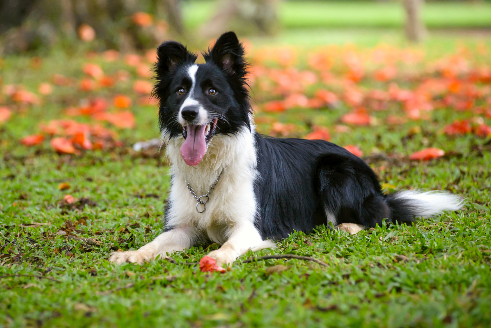

# Geo Pet

¡Bienvenido a **Geo Pet**! La mejor tienda en linea de artículos para mascotas.

## Perros

<table style="width:100"; border="2px">
  <tr>
    <th>Raza</th>
    <th>Tamaño</th>
    <th>Pelaje</th>
    <th>Forografía</th>
  </tr>
  <tr>
    <td>Border collie</td>
    <td>40-50 cm</td>
    <td>Medio, denso, impermeable y suave</td>
    <td></td>
    </tr>
  <tr>
    <td>Golden retriever</td>
    <td>40-50 cm</td>
    <td>Liso u ondulado, denso, impermeable y suave</td>
    </tr>
  <tr>
    <td>Pastor alemán</td>
    <td>40-50 cm</td>
    <td>Corto, denso, impermeable y suave</td>
</table>

***

## Gatos
 

***

## Aves

### Juguetes

1. Bolas.
2. Donas.
3. Peluches.

### Huesos

1. De cartílago.
2. De juguete.

### Camas

1. Grandes.
    - Blanca.
    - Negra.
    - Roja.
2. Pequeñas.

### Pelotas
1. De hule.
2. De tenis.
3. De golf.